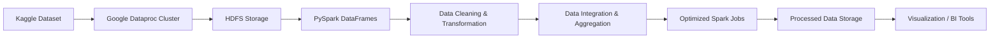

# 🛠️ Big Data Pipeline with Spark & Hadoop  
A complete end-to-end **Big Data Engineering project** on the **Brazilian E-Commerce Dataset**, covering ingestion, cleaning, transformation, integration, and serving with **HDFS + PySpark**.  

---

## 📌 Project Overview  
This project demonstrates how to build a scalable **data processing pipeline** using **Apache Hadoop (HDFS)** and **Apache Spark**.  
The dataset is ingested from Kaggle, processed in **Google Cloud Dataproc**, and transformed into clean, structured data for analysis & visualization.  

Key objectives:  
- Handle **large-scale data ingestion** into HDFS.  
- Perform **data cleaning, standardization, and transformation**.  
- Efficiently **integrate and aggregate data** across multiple tables.  
- Apply **Spark performance optimization techniques**.  
- Serve processed data for **downstream analytics and visualization**.  

---

## ⚙️ Architecture  

--

## 📂 Project Modules  

### 1️⃣ Data Ingestion & Exploration  
- Setup Hadoop & Spark environment.  
- Import raw CSV files into HDFS.  
- Load data into Spark DataFrames.  
- Perform Exploratory Data Analysis (EDA).  

### 2️⃣ Data Cleaning & Transformation  
- Handle missing values & duplicates.  
- Standardize date/time & categorical formats.  
- Correct data types.  
- Apply feature engineering.  
- Store cleaned data in Parquet (HDFS).  

### 3️⃣ Data Integration & Aggregation  
- Perform efficient joins across datasets.  
- Compute aggregations & metrics.  
- Resolve inconsistencies during integration.  

### 4️⃣ Performance Optimization  
- Use data partitioning for distributed jobs.  
- Apply caching for iterative queries.  
- Optimize Spark configurations.  

### 5️⃣ Data Serving & Visualization  
- Export final data to external systems (HDFS/Parquet).  
- Build visualizations to highlight business trends & insights.  

---
## Repository structyre
E-commerce-analysis-gcp/
│── README.md
│── notebooks/
│   ├── 01_Data ingestion and exploration.ipynb
│   ├── 02_Data cleaning and transformation.ipynb
│   ├── 03_data_transformation.ipynb
│   ├── 04_data_integration.ipynb
│── scripts/
│   ├── ingestion.sh
│   ├── hdfs_upload.sh
│── data/   (a txt file to get the link of the data)
│── docs/   

---

## 📊 Dataset Details  

The project uses the **Brazilian E-Commerce Public Dataset** from Kaggle.  
It includes multiple interlinked CSV tables:  

| Table Name                        | Primary Key | Description |
|-----------------------------------|-------------|-------------|
| `olist_orders_dataset`             | order_id    | Customer orders (timestamps, status, etc.) |
| `olist_customers_dataset`          | customer_id | Customer details & location info |
| `olist_order_items_dataset`        | order_item_id | Items within each order |
| `olist_products_dataset`           | product_id  | Product metadata |
| `olist_sellers_dataset`            | seller_id   | Seller details |
| `olist_order_payments_dataset`     | order_id    | Payment information |
| `olist_order_reviews_dataset`      | review_id   | Customer reviews |
| `product_category_name_translation`| category_id | Translations of product categories |

---

## 🚀 Setup Instructions  

### 1. Environment Setup  
- Provision a **Dataproc Cluster** (or AWS EMR / Azure HDInsight).  
- Install Hadoop & Spark.  

### 2. Data Ingestion  
```bash
# Create directories
mkdir ~/olist && cd ~/olist

# Download dataset
curl -L -o brazilian-ecommerce.zip https://www.kaggle.com/api/v1/datasets/download/olistbr/brazilian-ecommerce

# Unzip
unzip brazilian-ecommerce.zip -d ~/olist/data

# Move to HDFS
hdfs dfs -mkdir /data/olist/
hadoop fs -put ~/olist/data/*.csv /data/olist/
```
### 3. Start th spark session
```
futher codes are as per the notebook file
```


